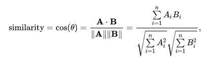

# TapoiMaps

 Implement an API allowing to evaluate the similarity of a user profile against a set of existing ones and to return the id of the most similar one. Attached you can find 4 profiles, each representing the topics discussed by a user together with the number of times each topic has been mentioned. Steps: 
+ 1. Propose a description of the system architecture. 
+ 2. Document the described API. 
+ 3. Implement the defined API. 
+ 4. Describe the matching algorithm used in order to identify, among the 4 available ones, the one most similar to the profile provided via API. 
+ 5. Prepare a dockerized version of your solution. 

<hr>

Developed by [Stefano Perenzoni]('mailto:stefano.perenzoni@gmai.com']) while enrolled at [Univerisity of Trento]( https://www.unitn.it/ )


<hr><hr>


# DISTANCE "METRIC" IDEAS

## Naive similarity calculation

Perform the similarity evaluation between 2 profiles in a simple and 'brute-forced' way:
```python
def metricFunc(x, y):
        xTw = sum(x)
        yTw = sum(y)
        dist = sum(min(x[i]/xTw, y[i]/yTw)**2 for i in range(len(x)))
        return dist
    
def computeNaiveDist(self, testDF):
        naiveMat = []
        for i in range(len(targetSDF):
            naiveMat.append(pairwise_distances(dfTest.append(targetsDF[i], 					sort=False).fillna(0), metric=metricFunc)[0,1])

        print(naiveMat)

        ind = argmax(naiveMat)
        return targetDF.id, naiveMat[ind]
```

Each value of both vectors is l1 "normalized" with the number of references for that profile so they are weighted and their value is relative to that profile.

A fixed real coefficient can be used to give more value to the fact that the two compared profiles just share a common topic instead of the number of their references for that topic


#### Cons

The longer a profile is the higher will be the similarity since the probability of same topics discussion increases.
It doesn't give any value to different topics discussed by different profiles


## Euclidean distance

Perform the similarity evaluation using the Normalized Euclidean distance and return the ID of the target-profile for which the Euclidean distance with the test-profile is the lowest.


Better accuracy can be obtained normalizing the vector x and y.

I used a l2-normalization to keep the coefficients small

So, for each profile, every topic reference counter was divided for the total number of references made by that user.


#### Cons
It's is not the best metric with sparse data like profiles which imply lots of dimensions. Moreover when the euclidean distance is used to perform distance evaluation on two vectors corresponding to words counter of a document (That's the idea of our application too) does not return meaningful results. 

Here's an [example]('http://mlwiki.org/index.php/Euclidean_Distance'):


P3 and P4 (7 common categories) must be more similar to each other than P1 and P2 (0 common categories). 


## Weighted Jaccard distance

Treating the user profile as a set allows us to apply the Jaccard similarity coefficient which is used to obtain the Jaccard distance that measures dissimilarity betweem two sets.


This would be restrictive for our case since it doesn't give any importance to the number of references that a user had for a certain topic.

Suppose we are evaluating the similarity between two profiles x and y.
They can be seen as two vectors with all non-negative values. (Which is exactly our situation)
Then the Jaccard similarity coefficient is defined as:


This coefficient is weighted with reference to number of references the two profiles had with the topics
From there we can obtain the Weighted Jaccard distance as:


### Cons

With the simple Jaccard distance no clue is given to number of references for each topic

The weighted Jaccard similarity resolves this problem but it is still less efficient than the cosine similarity


## Cosine Similarity

Perform the similarity evaluation using the cosine similarity 




Since it measures the angle between the two profiles we don't worry about the length of the profiles but about the distance in which each profile points which is described from the topics the user talked about.

It is similar to the Weighted Jaccard coefficient but the Cosine similarity can be  performed using the scikit library which returns better performances than the implementation of the Jaccard through a callable function.


## Performances

| Distance Metric           | Calls # | Average time (s) * | Min time (s) | Max time (s) |
| ------------------------- | ------- | ------------------ | ------------ | ------------ |
| Cosine similarity         | 5       | 0.953              | 9.173        | 9.751        |
| Weighted Jaccard distance | 5       | 1.080              | 1.040        | 1.105        |
| Euclidean distance        | 5       | 0.949              | 9.107        | 9.663        |
| Naive similarity          | 5       | 1,069              | 1,004        | 1,099        |

*All the time values include debug printing and HTTP response-request operations


We can easily observe that those evaluation performed using the scikit library are 10% more efficient than those that used a function self-defined.

In addition to Cosine similarity's precision, as explained before, it results more efficient than the Jaccard's one, which is the slowest. Indeed it averages a time of 1.080 s, quite similar to the Naive algorithm which showed evidents problem, both under performances and precision.

Although Euclidean distance had the best results in term of time, being a little bit better than Cosine similarity, this one gives more precise answers in term of profile matching since it doesn't have all the problems Euclidean algorithm presents which have been discussed before.


## Improve Similarity Result

Since that point we have talked about matching a test profile, presented with a json format, with target profiles in order to return the most similar one.

We talked about different matching algorithm to identify the most similar, each with its pros and cons in term of both performances and precision.

The comparison we are trying to accomplish is based on the Wikipedia's categories the users talk about on twitter with the number of times this topic had been discussed. At first an easy computation on the given categories can be enough to obtain satisfactory results, with increasing targets and growing topics these provided data may not be enough.

So pre-processing the given profiles can be useful and might improve our results.
Next, I am going to discuss about some elaboration that could bring significant improvements to the algorithms mentioned before.


### Wikipedia Categories

Wikipedia provides navigation links to pages in a hierarchy of categories which define characteristics of a topic and which users can browse and find sets of pages on topic defined by those characteristics. 

Categories are organized as overlapping trees formed by creating link between inter-related categories. Any category may contain subcategories, and it is possible for a category to be a subcategory of more than one "parent". Here's an example of what is meant with overlapping trees:


A clear use for categories is that of finding more common categories two users talk about, starting from those in their profile overview and adding the parents category to the user description associated with the same (or a lower) number of references of the main category from which the additional information had been extracted. 

What does that mean?
In  the next picture we can see an easy example of relations between more categories.
Suppose USER A talked a lot about Culture while USER B about Art several times.
We all agree that two profiles such those are quite correlated.
The application of the algorithms over these two profiles would obviously return a null similarity since the two don't share any categories. But, if we could expand USER B profiles adding the parent category Culture to its overview and launch the algorithms over these modified profiles the result will clearly change because now an important matching would be caught.


This can result as a big improvement for the similarity coefficient  because the new algorithms would catch matches that the older wouldn't get.  On the other hand this elaboration "removes" specific information from a user since the detailed given data describing a discussed and detailed category is analyzed and new wider general insights are extracted. These general information, which has been generated changing the specific nature of a profile, should bring an improvement in the similarity coefficient.

All of these can be used as a kind of conceptual similarity.

So this pre-elaboration helps the matching algorithm but its use is recommended depending on the detail level we want for our profiles.


### Wikipedia Languages

Everybody knows Wikipedia presents its pages with a language code and several pages are available in many languages. Thus, two pages about the same topic but in different languages are related.

Profiles contains Wikipedia's topics written not only in English but also in other languages so the similarity value given by two profiles talking about the same topic but in a different language wouldn't be included in our final result.

This can be solved using some Wikipedia APIs to retrieve the translation of every topic our users talked about, their addition to the user overview would decrease the distance between the two study subjects.

On the other hand, the same problem mentioned before would be introduced; with the addition of other pages to the user profile we are adding a lot of information to the same.
So we should ask ourselves if these changes are modifying the nature and the actual meaning of the user that we want to catch.

Is it important to recognize as different two users who talk about the same topic but with different languages or is it the same for our application?

Another problem this elaboration, as well as the others mentioned before, will introduce is that it would give to the algorithm more information that needs to be processed, thus the general complexity increases and the performances would suffer it.

<hr><hr>

# System description

## Introduction

Each profile is represented through the topics discussed (According to Wikipedia's titles) together with the number of times each topic as been mentioned.

```json
{
    "http://en.wikipedia.org/wiki/Category:Love": 1,
    "http://en.wikipedia.org/wiki/Category:Feudalism": 3,
    "http://en.wikipedia.org/wiki/Category:Human_behaviour": 2,
    "http://en.wikipedia.org/wiki/Category:2011_singles": 21,
    "http://en.wikipedia.org/wiki/Category:Primary_historical_works": 1,
}
```

After a bit of pre-elaboration I extracted a more compact representation of the user profile removing Wikipedia URI and keeping only the category name.

```json
{
    "Love": 1,
    "Feudalism": 3,
    "Human_behaviour": 2,
    "2011_singles": 21,
    "Primary_historical_works": 1,
}
```

I used profiles structured like this one to evaluate the similarity.


## System architecture

I developed a Web Service over HTTP using the architecture style knew as REST.

So I implemented the system thinking at some of the  architectural constraint which have to be respected to create a RESTful API.


+ ### Uniform Interface

I followed a familiar approach similar to other APIs.
The resources inside the system are accessible through a logical URI which name is related to the content of the resource.
The resource representations as well as the requests follow the  well defined format represented by Json and certain guidelines such as naming convention.
HTTP GET requests allow the user to access the resources but not to modify them. 
Resource adding operations can be performed through POST Requests and can be removed using DELETED Requests. 


+ ### Client - Server and stateless

There isn't any type of relationship between the client and the server. The server is able to evolve separately from the client which knows only the URIs of the resource and not their organization. 
Obviously the communications between the 2 are completely stateless. The server does not store anything about the requests the client had sent, each request is treat as a new one.
The application does not use an authentication system.


+ ### Layering

I did not layered my system, so I created a single web server which serve all the HTTP requests and also store all the data required from the algorithms to process and return a valid response to the client. This would absolutely be one of the focus point to improve the scalability of the system. The use of different servers, each used to perform specific field-related operation, for the execution of differenced tasks would help to keep good performances with a high number of profiles and users.


In conclusion, I did not follow all the constraints, which define a truly RESTful API, I  violated some of them which were not necessary because of the reduced dimensions and complexities of the system.


### Storage

Since the reduced complexity of the system my idea was that of storing the files locally without using an external storage support. I did not use any type of database to store the profiles and I saved them locally on the Web Server with a Json format. So with an higher number of observation for each profile and an increasing amount of users the process would become slower. Because of that I started looking for something faster and scalable.
This decision also implies the necessity of restarting the web service after the addition/delete of a file json representing an user profile if these operation are done manually and not using the available API.

I looked for some pandas compatible format alternatives to Json that would speed up the operations. This would have allowed me to speed up the initialization of the web server which compute the uploading of all the user profiles in different dataframes and would allow me to switch the storage system architecture in a way which performs the reading of the profiles only when it is required. This will decrease the amount of memory used by the application because profiles are not permanently loaded as dataframes but on the other hand the number of reading operation from the files representing the users rises because we have to load all the dataframes at every requests to evaluate the similarity.

Because of this I looked for an alternative format that would help my application to scale, being faster and lighter. 

According to [this article](https://towardsdatascience.com/the-best-format-to-save-pandas-data-414dca023e0d) I find many interesting facts.

Some format had been valuated under 5 metrics which include file size, save time (save dataframe onto a disk) and load time (load dumped dataframe into memory) . What matters more for our application is the load_time since it's the time required from the operation of reading the stored file uploading it as dataframe while saving operations (PUT /profiles) are quite rare.
The mentioned study shows some well-known information, like the slowness of a CSV file, but also some others that could help us take a decision such as, for example, the impressive results in term of load time for parquet and feather.
We can notice how feather and parquet have great values for the memory consumption during the operation of saving and loading. Parquet also shows impressive results in term of file size.

Changing approach and treating the data as Pandas Categorical does return different insights. Binary formats reach fantastic scores with parquet being the slower in term of save operations but in the average for load time. Talking about file size parquet and feather obtain more or less the same results but parquet shows noticeable overhead in memory consumption during the operation of loading since it requires an extra amount of resources to un-compress the data back into a dataframe.

To sum up, even though feather shows better general results I think that for our system the best choice is the parquet format. Indeed feather is not expected to be used as a long-term file storage while parquet is. 
In addition, parquet is supported by many different systems that perform analytics such as Spark and AWS Services which would help our application scaling.


## Scalability

I already mentioned a bunch of choices or possible improvements that could help against the huge scalability challenge; for instance the use of third parties libraries like scikit, the introduction of a lighter format or the layering of the system architecture would all promote the application scalability. Anyway, now I'm going to talk about actual solutions that allow out web service to keep good performances with an higher number of user, requests and, therefore, traffic.


### Load sharing through redirection

A distributed architecture (as mentioned before) consisting of independent servers sharing the load is a fundamental key for implementing a web server. Most suggest using some form of Weighted Round-Robin implemented using the DNS server, this approach requires each server to handle requests for all the data stored; a problem that can be solved in two different ways: a first one which requires that each server must store its own copy of all the data or a second alternative  implying to access the data from other HTTP servers (doing requests) or some database servers (doing requests), both generate significant back-end traffic which requires additional resources to be processed not allowing the application to scale properly.
Thus, a  "redirection-based" hierarchical architecture is often preferred since it eliminates bottlenecks in the server and allows the introduction of new hardware to handle increases in load. Here, two levels of server are used, each storing partitioned data according to their content. There are redirection servers used to distribute the users requests to the corresponding normal HTTP servers which respond to client's requests.
This kind of approach results completely transparent to the user and achieves better caching efficiency compared with other load balancing schemes guaranteeing a great scaling.  


### Horizontal scalability

Thinking about our specific application should be said that we are facing a structure that fits well for horizontal scalability. The addition of more machines would give us the opportunity to distribute the data over multiple servers. Thus each of these servers would perform the similarity coefficient evaluation over a restricted set of the target profiles. Then the results obtained from each machine can be merged together to extract global insights.
So every server becomes faster and the performance raise.
In addition, while horizontal scaling is less suitable for Relational DB as it relies on consistency and atomicity, NoSQL databases take advantages of horizontal scalability since they follow the de-normalization concept so duplicates can be stored. Our application doesn't involve neither strict atomic transactions or elevate number of joints so horizontal scaling used together with NoSQL DB would boost the productivity


### Storage support

As mentioned before the efficiency may raise using a database to store our files representing the profiles. Although we can observe a kind of relational structure in our data, since Wiki categories could be seen as a big table containing thousands of rows which are related to user profiles, I don't think this solution would guarantee the best performances.
I would rather use systems designed for document store which compose one of the main categories of NoSQL databases. These types of database fits perfect with our necessity of storing semi structured data encoded in standard format such as Json.
I will focus on two of the most famous DBMS from the mentioned class: MongoDB and CouchDB. The two differs in several aspects, starting from the DB structure. CouchDB stores JSON format offering CRUD operations above them, MongoDB use a less strict structure allowing schema-free data storing in a binary format, so documents are not required to have a predefined structure so different documents in the collection can have different columns; a feature that fits perfectly for our system. While CouchDB achieves scalability through master-slave replication (The master perform the writes and then passes the updated information to the slaves which can perform read anytime) MongoDB does it horizontally supporting automatic sharding, distributing documents over servers and uses replication just for failover.
MongoDB provides faster read speeds and it is the better choice for a rapidly growing database that could be our case because of the profiles' size so i would recommend it more than CouchDB.

A third alternative would be that of adopting a graph database storing each profile and each category as a single node; references from an user for a specific topic could be represented using weighted edges. Scalability is usually great for these types of graphs and they are much more adequate to handle changing data with evolutionary pattern. On the contrary Relational and NoSQL DBMS are typically faster in performing the same operations on a large number of data.

<hr><hr>

# Documentation

## Get ID of the most similar profile

It takes a JSON object representing a user profile and perform the evaluation of the similarity coefficient  for  every profile stored previously.
The ID of the most similar is returned with the value of the similarity associated

**URL: ** /similarity

**METHOD: ** GET

**BODY: **

A json representing an user profile

```json
{
    "Love": 1,
    "Feudalism": 3,
    "Human_behaviour": 2,
    "2011_singles": 21,
    "Primary_historical_works": 1,
}
```


**PARAMETERS: **


+ **alg**

> Tells the server which algorithm run to evaluate the similarity between the profiles
>
> default = cosine
>
> > **cosine**, is used the cosine similarity
> >
> > >The returned value represents the similarity between 2 profile, 1 means no differences
> >
> > **euclidean**, is used the (l2) normalized euclidean distance
> >
> > > The returned value represents the distance between 2 profiles, 0 means no differences
> >
> > **naive**, is used a personalized algorithm
> >
> > >The returned value represents the similarity between 2 profiles, the higher the more similar are the 2 users
> >
> > **jaccard**, is used the Weighted Jaccard Distance
> >
> > >The returned value represents the similarity between 2 profiles, 0 means no differences


**RESPONSE 200: **(application/json)

```json
{
	"matches": [
        {
            "id":'roger'
        },
        {
        	"id":'stefano'
        }
    ],
    "metric":"cosine",
    "similarity":0.897
}
```

<hr>


## Get all profiles

Return a list of all the profile's IDs memorized inside the application

**URL: ** /profiles

**METHOD: ** GET

**RESPONSE 200: **(application/json)

```json
[
  {
    "id": "emma"
  }, 
  {
    "id": "michelle"
  }, 
  {
    "id": "roger"
  }, 
  {
    "id": "tim"
  }
]
```

<hr>


## Get profile whole description

Given a profile ID returns the whole profile overview in json format.

**URL: ** /profiles/<id>


<id> must be an existing profile's ID

**METHOD: ** GET

**RESPONSE 200: **(application/json)

```json
{
	"id":'Stefano',
	"data":	{
        "Love": 1,
        "Feudalism": 3,
        "Human_behaviour": 2,
        "2011_singles": 21,
        "Primary_historical_works": 1
    }
}
```

<hr>


## Add a new profile

It takes a JSON object representing a user profile,  an argument for the profile ID and stores the new named profile in the application

**URL: ** /profiles


**METHOD: ** POST

**BODY: **

A json representing an user profile

```json
{
    "Love": 1,
    "Feudalism": 3,
    "Human_behaviour": 2,
    "2011_singles": 21,
    "Primary_historical_works": 1
}
```

**PARAMETERS: **

+ **id**

>Tells the application the ID of the new uploaded profile
>It must be new and not already in use

**RESPONSE 200: **(application/json)

```json
{
	"message":"Profile add correctly",
	"id":'roger'
}
```

<hr>

## Remove an existing profile

It takes an argument for the profile ID and deletes that profile from the application storage

**URL: ** /profiles


**METHOD: ** DELETE


**PARAMETERS: **

+ **id**

>Tells the application the ID of the new uploaded profile
>It must exist

**RESPONSE 200: **(application/json)

```json
{
	"message":"Profile removed correctly",
	"id":'roger'
}
```

<hr>


