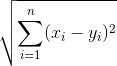

# DISTANCE "METRIC" IDEAS

## Naive similarity calculation

Perform the similarity evaluation between 2 profiles in a simple and brute-forced way:
```python
def metricFunc(x, y):
        xTw = sum(x)
        yTw = sum(y)
        dist = sum(min(x[i]/xTw, y[i]/yTw)**2 for i in range(len(x)))
        return dist
    
def computeNaiveDist(self, testDF):
        naiveMat = []
        for i in range(len(self.targetDF):
            naiveMat.append(pairwise_distances(dfTest.append(self.targets[i], 					sort=False).fillna(0), metric=metricFunc)[0,1])

        print(naiveMat)

        ind = argmax(naiveMat)
        return self.targets[ind].iloc[0].name, naiveMat[ind]
```

Each value of both vectors is "normalized" with the number of references for that profile so they are weighted and their value is relative to that profile.

A fixed real coefficient can be used to give more value to the fact that the two compared profiles just share a common topic instead of the number of their references for that topic


#### Cons

The longer a profile is the higher will be the similarity since the probability of same topics discussion increases.
It doesn't give any value to different topics discussed by different profiles


## Euclidean distance

Perform the similarity evaluation using the Normalized Euclidean distance and return the ID of the targetProfile having lowest for which the Euclidean distance with the testProfile is the lowest.



Better accuracy can be obtained normalizing the vector x and y.

I used a l2-normalization to keep the coefficients small

So, for each profile, every topic reference counter was divided for the total number of references made by that user.


#### Cons
It's is not the best metric with sparse data like profiles. They are sparse bacause we have a lot of dimensions
Then the term frequency can cause problems.


## Weighted Jaccard distance

Treating the user profile as a set we can apply the Jaccard similarity coefficient which is used to obtain the Jaccard distance that measures dissimilarity betweem two sets.


This would be restrictive for our case since it doesn't give any importance to the number of references that a user had for a certain topic.

Suppose we are evaluating the similarity between two profiles x and y.
They can be seen as two vectors with all non-negative values. 
Then the Jaccard similarity coefficient is defined as:


This coefficient is weighted with reference to number of references the two profiles had with the topics
From there we can obtain the Weighted Jaccard distance as:


### Cons

With the simple Jaccard distance no clue is given to number of references for each topic

Using the weighted Jaccard similiraty resolves this problem but is still less efficient than the cosine similarity


## Cosine Similarity

Perform the similarity evaluation using the cosine similarity 


So we don't worry about the length of the profiles.

It is similar to the Weighted Jaccard coefficient but the Cosine similarity can be  performed using the scikit library which returns better performances than the implementation of the Jaccard through a callable function.


### Performances

| Distance Metric           | Calls # | Average time (s) * | Min time (s) | Max time (s) |
| ------------------------- | ------- | ------------------ | ------------ | ------------ |
| Cosine similarity         | 5       | 0.953              | 9.173        | 9.751        |
| Weighted Jaccard distance | 5       | 1.080              | 1.040        | 1.105        |
| Euclidean distance        | 5       | 0.949              | 9.107        | 9.663        |
| Naive similarity          | 5       | 1,069              | 1,004        | 1,099        |

*All the time values include debug printing operations


In addition to Cosine similarity's precision, as explained before it results more efficient than the Jaccard's one, which is the slowest. Indeed it averages a time of 1.080 s, quite similar to the Naive algorithm which showed evidents problem, both under performances and precision.

Although Euclidean distance had the best results in term of time, being a little bit better than Cosine similarity, this one gives more precise answers in term of profile matching since it doesn't have all the problems Euclidean algorithm presents which have been discussed before.


### Improve Similarity Result

Since that point we have talked about matching a test profile, presented with a json format, with target profiles in order to return the most similar one.

We talked about different matching algorithm to identify the most similar, each with its pros and cons in term of both performances and precision.

The comparison we are trying to accomplish is based on the Wikipedia's categories the users talk on twitter with the number of times this topic had been discussed. At first an easy computation on the given categories can be enough to obtain satisfactory results, with increasing targets and growing topics these provided data may not be enough.

So a pre-processing the given profiles can be useful and might improve our results.	        Next i am going to discuss about some elaboration that could could the algorithms mentioned before.


#### Wikipedia subpages

Wikipedia structures its links in a hierarchy way which relates together pages to others which are linked in the main page. Those linked resources are considered "subordinate" to its host and they are linked as [[Parentpage/Subpage]]. It is possible to create sub-subpage. 				 A clear use of this feature could be that of using MediaWiki API to find subpages of those the users we are comparing talked and add them to the profile description associated with the same number of references of the mainpage.
In this way two profiles that discussed similar, but different, topics could returns higher similarity coefficients given by the addition of the subpages to their profile overview if these new pages are "shared" by both account.

We can immediately note that similarity coefficient can improve because the users discussed similar topics which were not caught by the base algorithms and it would increase the accuracy of the matching but, since every wikipedia page spreads a lot, with several "children", the coefficient could have risen because of the matching of a subpage obtained from two mainpages which are not related, at all.

So this pre-elaboration adds lots of information to user profiles changing its specific nature and falsifying the similarity coefficient. Therefore this implementation is not recommended.


#### Wikipedia Categories

Wikipedia provides navigation links to pages in a hierarchy of categories which define characteristics of a topic and which users can browse and find sets of pages on topic defined by those characteristics. 

A clear use for categories is that of finding categories which a user talk about, starting from the topic in its profile overview and adding them to the user description associated with the same number of references of the topic from which the category had been extracted.

This can result as a big improvement for the similarity coefficient  because the new algorithms would catch new matches that the older wouldn't get.  On the other hand this elaboration "removes" specific information from a user since the detailed data describing  a discussed and detailed topic is analyzed and new general insights are extracted. These general information should bring an improvement in the similarity coefficient which has been generated changing the specific nature of a profile.

All of these can be used as a kind of conceptual similarity.

So this pre-elaboration helps the matching algorithm but its use is recommended depending on the detail level we want for our profiles.


#### Wikipedia Languages

Everybody knows Wikipedia presents its pages with a language code and several pages are available in many languages. Thus two pages about the same topic but in different languages are related.

Profiles contains Wikipedia's topics written not only in English but also in other languages so two profiles talking about the same topic but in a different language wouldn't add any value to the similarity coefficient.

This can be solved using some Wikipedia APIs to retrieve the translation of every topic our users talked about, their addition to the user overview would decrease the distance between the two study subjects.

On the other hand, the same problem mentioned before would be introduced; with the addition of other pages to the user profile we are adding a lot of information to the same.
So we should ask ourselves if these changes are modifying the nature and the actual meaning of the user that we want to catch.

Is it important to recognize as different two users who talk about the same topic but with different languages or is it the same for our application?

Another problem this elaboration, as well as the others mentioned before, will introduce is that it would give to the algorithm more information that needs to be processed, thus the general complexity would increase and the performances would suffer it.


Use HDF5 for better perfomances in file reading, or Parquet

The operation of creating a single DF containing every target and the test creates a lot of column where both the analyzed vectors have 0 reference, there a lot of time is lost


At first i loaded every profile on a single DF filling nan with zeros, it was so ineficient so i changed